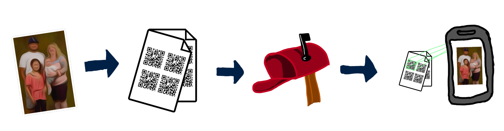

# File to QR

## _They say a picture is worth 1000 QR codes._

Have you ever wanted to send _lossless_ files through the postal service with
only your home printer? Now you can! 



### How to run:

#### Encoding files to QR codes

The encoding utility is writen in [Go](https://golang.org/) and you will need to have it installed to run.

At its simplest, run the encoder with `go run` and the `--in_file` flag in the repository root. This will output an auto-named `pdf` to the `./out` folder in the repository.

E.g.

```bash
go run . --in_file=path/to/file.png
```

There are a number of flags to modify functionality:

```
-bytes_per_qr int
        Maxmimum bytes per QR code. (default 2000)
-in_file string
        Input file to convert to a PDF of QR codes. (default "test_files/tiny.png")
-out_file ./out
        Output PDF path and name. If empty, will be written to ./out and name will be autogenerated.
-page_margin float
        Margin around of the border of each page to not render QR codes. (default 0.25)
-page_size string
        Size of each page in the output PDF. Defaults to 'letter'. See https://godoc.org/github.com/jung-kurt/gofpdf#pkg-constants for supported values. (default "letter")
-page_title string
        String to be printed at the top of every page. (default "A file for you")
-qr_codes_per_row int
        Number of QR codes to fit per row. The QR code will stretch to fit the row width. The number of rows will depend on the height of each row. 
(default 2)
  -temp_dir string
        Temporary directory where created QR code images are written to disk before being inserted into the PDF. (default OS GENERATED TEMP DIRECTORY)
```

#### Android App

The android app was built in Android Studio with API 29+. You should be able to open the `./android_app/qr` folder in Android Studio as a project and build. You might have to download or install certain API versions or depedencies to get the build working.


### Contributing

Anyone is welcome to contribute by sending me pull requests. This is a silly app concept that I currently don't intend to work on past this proof of concept. Some ideas of work that would benefit this project:

- iPhone app (I currently don't have a Mac to build one).
- Website to perform the encodings.
- Tests, refactoring, documentation, code health etc.

### (Buggy Gif) Video of App:

